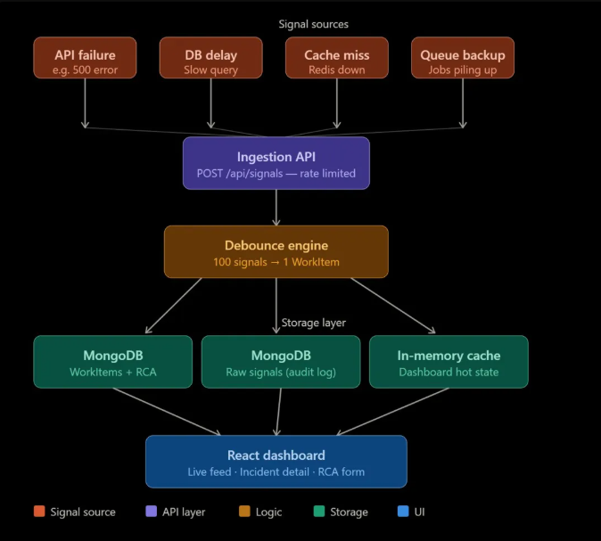

# Incident Management System (IMS)

An incident management system that ingests high frequency error signals, reduces alert noise through a debounce engine and surfaces actionable work items with enforced Root Cause Analysis.

## Live Demo

- Frontend: https://incmasys.netlify.app

## Architecture



```
Signal Sources (API failures, DB delays, Cache misses, Queue backups)
        ↓
Ingestion API (Rate limited - 100 req/min)
        ↓
Debounce Engine (10s window - 100 signals → 1 WorkItem)
        ↓
MongoDB Atlas
├── signals     → Raw audit log (every signal stored)
├── workitems   → Structured incidents (engineers work on these)
└── rcas        → Post-mortem records (written once, never changed)
        ↓
React Dashboard (Live feed, Incident detail, RCA form)
```

## Tech Stack

| Layer | Technology | Why |
|---|---|---|
| Backend | Node.js + Express | Async, non-blocking, fast |
| Database | MongoDB Atlas | Flexible schema, high write volume |
| Frontend | React + Vite | Component-based, fast builds |
| Rate Limiting | express-rate-limit | Protect against signal floods |
| Hosting (BE) | Render | Free Node.js hosting |
| Hosting (FE) | Netlify | Free React hosting |
| Container | Docker + Compose | One-command local setup |

## Design Patterns Used

- **Strategy Pattern** — SEVERITY_MAP swaps alert priority per component type
- **State Pattern** — VALID_TRANSITIONS enforces OPEN→INVESTIGATING→RESOLVED→CLOSED
- **Debounce Pattern** — 10s window collapses duplicate signals into one WorkItem

## How Backpressure is Handled

- Rate limiting blocks excess signals at API layer (max 100/min)
- In-memory debounce Map prevents duplicate DB writes
- Retry logic with exponential backoff handles temporary DB slowness
- Async/await throughout — Node.js event loop handles bursts without blocking

## Quick Demo (See It Working)

### Option 1: View Live App 

Just open the browser. Incidents are already loaded from previous runs.

```
https://incmasys.netlify.app
```

---

### Option 2: Send a Single Signal 

Send one signal directly to the live backend and see it appear
on the dashboard within 5 seconds.

**Windows PowerShell:**
```powershell
Invoke-WebRequest `
  -Uri "https://ims-backend-yx2q.onrender.com/api/signals" `
  -Method POST `
  -ContentType "application/json" `
  -Body '{"componentId":"PAYMENT_API","type":"API_FAILURE","message":"Payment timeout"}'
```

**Mac/Linux:**
```bash
curl -X POST https://ims-backend-yx2q.onrender.com/api/signals \
  -H "Content-Type: application/json" \
  -d '{"componentId":"PAYMENT_API","type":"API_FAILURE","message":"Payment timeout"}'
```

Then open https://incmasys.netlify.app — incident appears automatically.

---

### Option 3: Run Full Simulator (Sends 7 signals, shows debounce)

Clone the repo and run the simulator against the live backend.
No local server needed — simulator sends signals to Render directly.

```bash
git clone https://github.com/Yashu2133/IMS
cd IMS/backend
npm install
node simulator.js
```

Then open https://incmasys.netlify.app


> Note: simulator.js sends to the live Render backend by default.
> If you want to run locally instead, change BASE_URL to
> http://localhost:5000/api/signals before running.

---

### Option 4: Run Locally with Docker (Full local setup)

Run the entire app on your own machine with one command.
Needs your own MongoDB Atlas URI.

```bash
# Step 1: Clone
git clone https://github.com/Yashu2133/IMS
cd IMS
```

Create root `.env` file:
```
MONGO_URI=your_mongodb_atlas_uri
```

```bash
# Step 2: Start everything (backend + frontend)
docker-compose up --build
```

```
Backend running at:  http://localhost:5000
Frontend running at: http://localhost:5173
```

```bash
# Step 3: Open new terminal — update simulator URL then run
# Change BASE_URL in simulator.js to:
# http://localhost:5000/api/signals
cd IMS/backend
node simulator.js
```

```bash
# Step 4: Open browser
http://localhost:5173
```

Incidents appear on the dashboard automatically.

```bash
# To stop
docker-compose down
```

> Note: Without running simulator in Step 3,
> dashboard will be empty because local MongoDB has no data yet.

---

## API Endpoints

| Method | Endpoint | Description |
|---|---|---|
| POST | /api/signals | Ingest a signal |
| GET | /api/workitems | List all incidents |
| GET | /api/workitems/:id | Get incident detail |
| PATCH | /api/workitems/:id/status | Move to next status |
| POST | /api/workitems/:id/rca | Submit RCA and close |
| GET | /api/signals/:workItemId | Get signals for incident |
| GET | /health | System health check |

## Incident Lifecycle

```
OPEN → INVESTIGATING → RESOLVED → CLOSED
```

- CLOSED is blocked by the system if RCA is missing
- MTTR is auto-calculated from RCA timestamps
- All signals linked to one WorkItem via debounce

## Resilience Features

- Rate limiting — 100 signals/min max on ingestion API
- Retry logic — 3 attempts with exponential backoff (200ms, 400ms, 600ms)
- Health endpoint — GET /health returns uptime and signals processed
- Throughput metrics — signals/sec printed to console every 5 seconds

## Sample Signal Types

| Type | Severity | Example |
|---|---|---|
| DB_DELAY | P0 | MongoDB query took 8000ms |
| API_FAILURE | P1 | Payment API returned 500 |
| QUEUE_BACKUP | P1 | 5000 jobs pending |
| CACHE_MISS | P2 | Redis not responding |